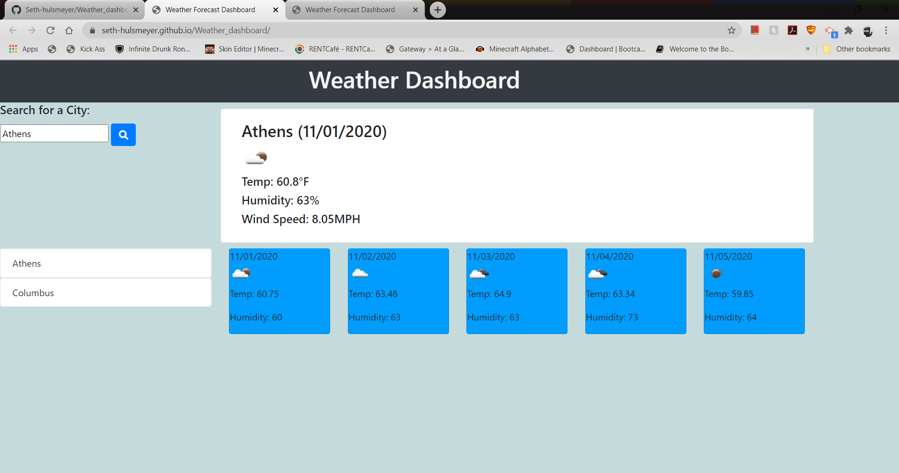

# Weather_dashboard

With this weather/forecast application, a user can search for a city of their choice. After hitting enter or clicking the search button, that city's current weather will be displayed.

The user will also see a 5-day forecast below the current weather.

The city that the user chose will also be saved to local storage and populate to the page below the search bar, next to the 5-day forecast.

Live link: https://seth-hulsmeyer.github.io/Weather_dashboard/
